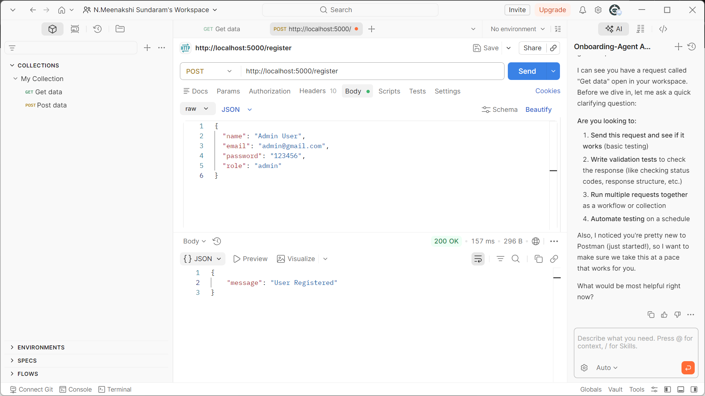
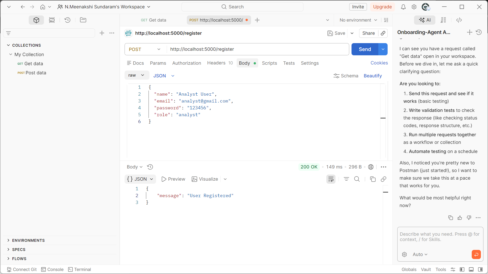
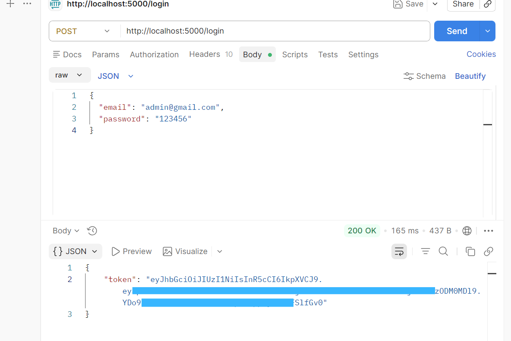
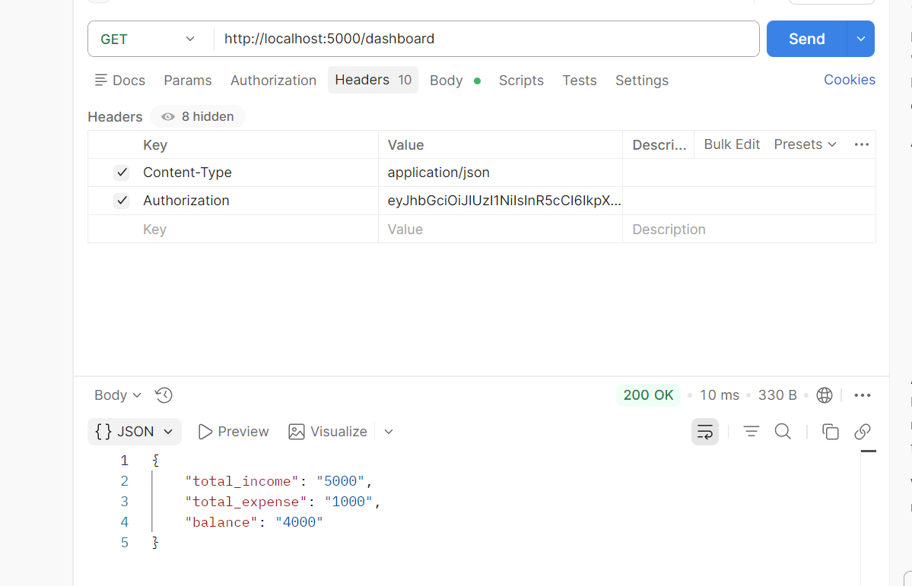
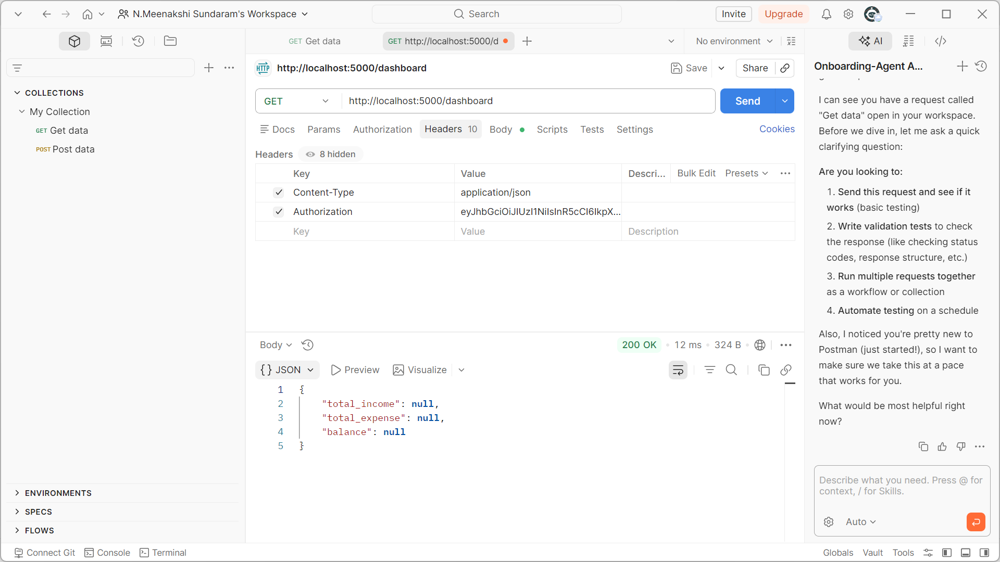
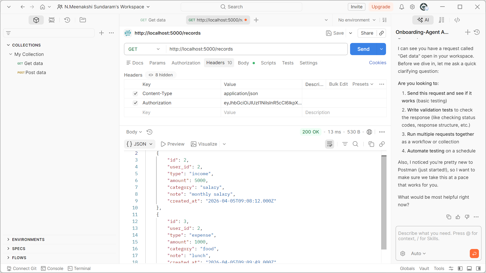
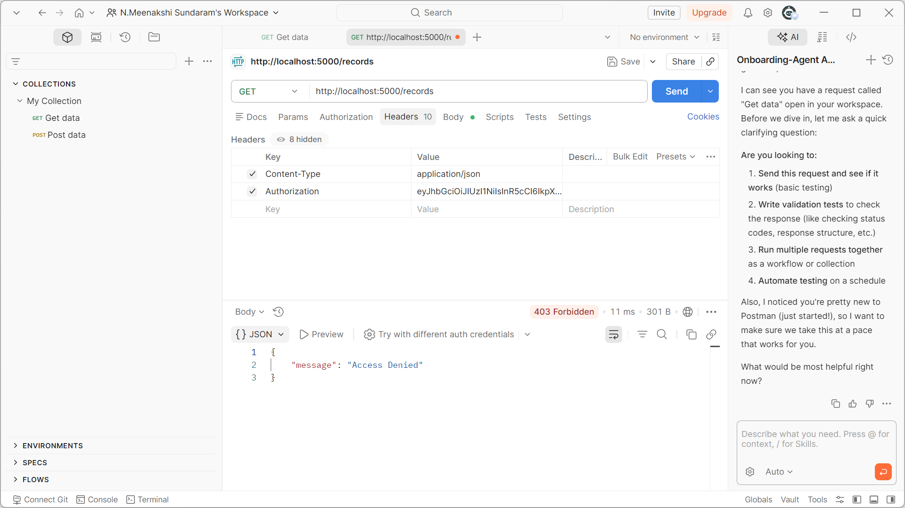

## Finance Data Processing and Access Control Backend (FDP/FAC)

## Project Overview

   1. This project implements a backend system for managing financial data with role-based access control.  
   2. It provides secure APIs to create, manage, and analyze financial records such as income and expenses.
   3. The system supports multiple user roles and ensures controlled access to data based on permissions.

## Technology Stack

   - Backend: Node.js, Express.js  
   - Language: JavaScript  
   - Database: MySQL  
   - Authentication: JSON Web Token (JWT)  
   - Security: bcrypt  
   - API Testing: Postman  
  
## Key Features

   ✔ Implement user authentication using JWT  
   ✔ Enforce role-based access control (Admin, Analyst, Viewer)  
   ✔ Perform CRUD operations on financial records  
   ✔ Generate dashboard summaries (income, expense, balance)  
   ✔ Provide category-wise financial insights  
   ✔ Handle errors and validate input data  
  

## Installation & Setup

   1. Clone the repository
   2. **Install dependencies** : npm install
   3. **Configure environment variables**
      - Create a .env file and add :
      - PORT=5000
      - DB_HOST=localhost
      - DB_USER=root
      - DB_PASSWORD=your_password
      - DB_NAME=finance_db
      - JWT_SECRET=your_secret_key
   4. **Start the server** : npm run dev

## API Endpoints

   1. **Authentication**
      - POST /register → Create a new user
      - POST /login → Authenticate user and return token
   2. **Financial Records**
      - POST /add → Create a new record (Admin only)
      - GET /records → Fetch records
      - PUT /update/:id → Update record
      - DELETE /delete/:id → Delete record
   3. **Dashboard**
      - GET /dashboard → Get total income, expense, balance
      - GET /category-summary → Get category-wise totals

## Output

**Register**

  
  
   
  <em>Left: Admin Register | Right: Analyst Register</em>

 

**Login**

  
  
   
  
 "JWT token is partially masked for security purposes" 

   
  <em>Left: Admin Login | Right: Viewer Register</em>

 

**Dashboard**

  
  
   
  <em>Left: Admin Dashboard | Right: Analyst Dashboard</em>

 

**Record**

  
  
   
  <em>Left: Admin Record | Right: Viewer Record</em>

## Challenges & Solutions

   - Resolved JWT authentication issues by correcting token format in request headers
   - Fixed role-based access errors by validating user roles in middleware
   - Handled empty API responses by ensuring user-specific data filtering in queries
   - Debugged server errors by improving error handling and logging
  
## Project Impact

   - Resolved JWT authentication issues by correcting token format in request headers
   - Fixed role-based access errors by validating user roles in middleware
   - Handled empty API responses by ensuring user-specific data filtering in queries
   - Debugged server errors by improving error handling and logging

## Future Enhancements

   - Add filtering options (date, category, type)
   - Implement pagination for large datasets
   - Integrate frontend dashboard
   - Deploy using cloud services (AWS / Render)
   - Add API documentation (Swagger)

## Author

Developed by : Meenakshi Sundaram 
 
Email        : nmeenakshisundaram257@gmail.com